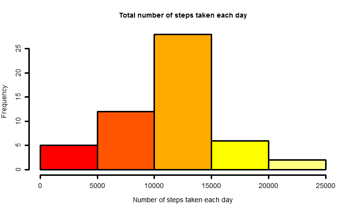
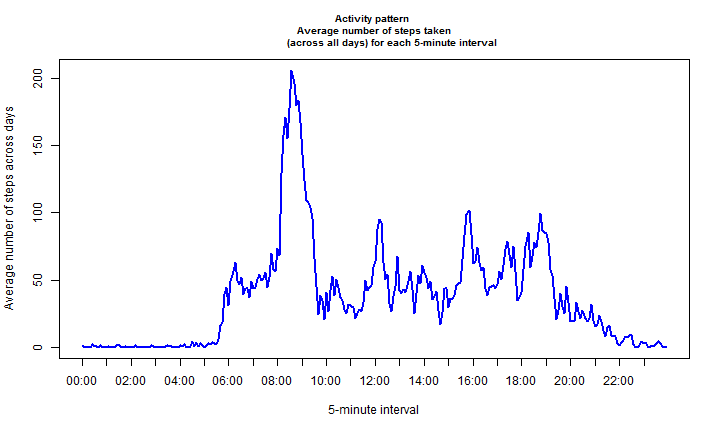
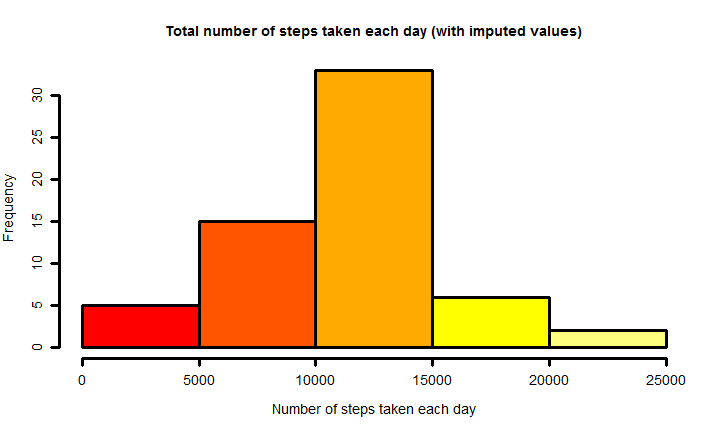
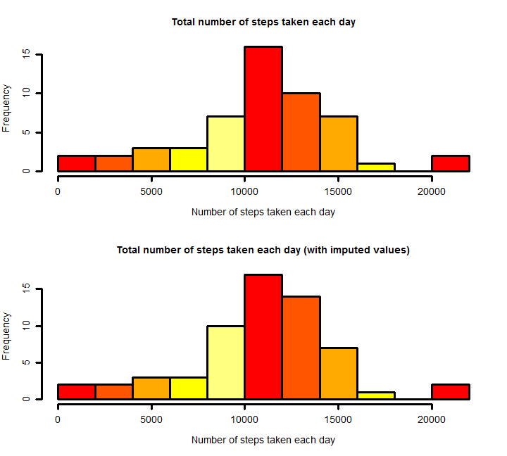
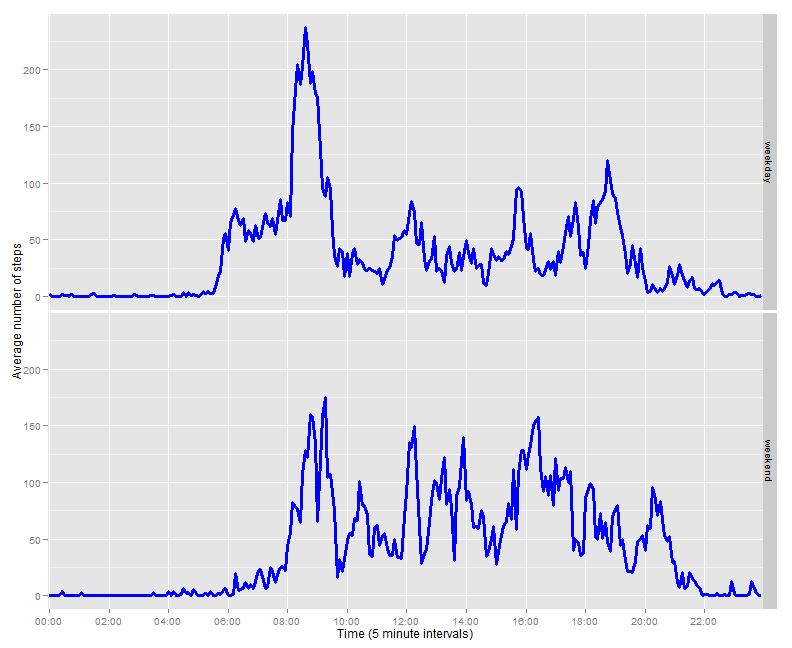

# Reproducible Research: Peer Assessment 1
___________________________________________

This is my submission for the *Peer Assessment 1* in the *Reproducible Research (May 2014)* course, of the *Coursera &amp; Johns Hopkins Data Science Specialization*. The repository for this and the associated files is:

https://github.com/fss14142/RepData_PeerAssessment1

The description of the project can be found in the `README.md` file in that repository. Please refer to that file for the detailed information about the dataset used in this project, its variables, and the goals of the project.  
For the analysis here we will follow the structure provided in the template file `PA1_template.Rmd` provided by the course staff. 

### Requirements of the analysis

This analysis was performed using R version 3.1.0 (2014-04-10) running on a Windows 7 x64 machine. The following code performs an initial cleanup and loads the required libraries (these are assumed to be installed in the system). Besides, some global knitr options are set: 


```r
rm(list = ls())
library(xtable)
library(lattice)
library(ggplot2)
opts_chunk$set(echo = TRUE, tidy = FALSE)
```

Besides, it is expected that the 'activity.zip', containing the project data, has been downloaded to the Working Directory.


## Loading and preprocessing the data

The script will unzip the data file . If the zip file is not found, an error is thrown.


```r
zipFileName <- "activity.zip"
if(file.exists(zipFileName)){
    unzip(zipFileName)
    dataOk = TRUE
} else {
    ## if zip file does not exist either, execution stops with an error message.
    warning("No data zip file found.")
}
```


Now that the data is ready, we begin by using `read.table` to load the data into a data frame called `activity`. Next we call `str` on `activity` to get basic information about the data frame:


```r
activity <- read.table(file="activity.csv", sep=",", header=TRUE, na.strings="NA")
str(activity)
```

```
## 'data.frame':	17568 obs. of  3 variables:
##  $ steps   : int  NA NA NA NA NA NA NA NA NA NA ...
##  $ date    : Factor w/ 61 levels "2012-10-01","2012-10-02",..: 1 1 1 1 1 1 1 1 1 1 ...
##  $ interval: int  0 5 10 15 20 25 30 35 40 45 ...
```


### Combining the date and interval variables into a POSIXct variable. 

The data set contains data from a personal activity monitoring device. More precisely, it contains (in the variable `steps`) the number of steps taken in 5 minute intervals each day, by an anonymous individual. The data were collected during the months of October and November, 2012. The `date` variable provides the information about the day when a particular observation was collected.

Let us now describe the `interval` variable of the data set. The total number of 5 minute intervals in a day is $latex \dfrac{24\cdot 60}{5}=$` 288

The count of intervals for each day begins at 00:00 (interval number 1) and ends at 23:55 (interval number 288). The `interval` variable in the `activity` data frame encodes the intervals in a such a way that, e.g. the interval beginning at 16:45 is encoded as 1645. Thus, the `interval` variable value corresponding to the interval beginning at 00:00 is 0, and the  `interval` variable value corresponding to the interval beginning at 23:55 is 2355. 

In many cases, the the next interval in the sequence is obtained by adding 5 to the previous one. Take, for example, the interval beginning at 12:45, which is encoded as 1245. Then the following interval is encoded as `1245 + 5 =` 1250. However, for the intervals corresponding to the end of a 1-hour period, this does not hold. For example, the interval beginning at 13:55, encoded as 1355, is followed by the interval beginning at 14:00, encoded as 1400. And certainly 1400 is not equal to 1355 + 5. Thus, the sequence of integer values of the `interval` variable  cannot be directly interpreted as equally-spanning time intervals.

Partly because of this, it is more convenient to combine the `date` and `interval` variables into a new `hourMinute` variable, which contains the POSIXct formatted date and time information about the 5-minute interval when the measure was taken.  

To convert a 5 minute interval encoded as 725 into the standard 07:25 representation we will proceed as follows:
    
* We find the minutes part (25 in the example) of the interval, as the remainder of the value of `interval` divided by 100.
* To find the hour part (7 in the example), we subtract the minute part from `interval`, and divide (integer division) by 100. 
* We add some padding zeros to the left of the hour and minute, as required to get the standard 2-digit representation. In the example, 7 is converted to 07. Note that the first two intervals, encoded as 0 and 5 respectively, need to be converted to 00 and 05. These are the only cases that require extra zeros to be added to the minute part.  
* Finally, the hour and minute part are pasted together, using : as separator.

The corresponding R code follows. 

```r
minute <- activity$interval %% 100
hour <- (activity$interval - minute) %/% 100

minute <- formatC(minute, width = 2, format = "d", flag = "0")
hour <- formatC(hour, width = 2, format = "d", flag = "0")

hourMinute <- paste(hour, minute, sep=":")
```

We show the `head` and `tail` of the `hourMinute` variable to check the result:

```r
head(hourMinute)
```

```
## [1] "00:00" "00:05" "00:10" "00:15" "00:20" "00:25"
```

```r
tail(hourMinute)
```

```
## [1] "23:30" "23:35" "23:40" "23:45" "23:50" "23:55"
```

Now we are ready to paste together `activity$date` and `hourMinute`, and convert the result to a POXISct formatted variable. The resulting variable, called `dateTime` is added to the activity data frame:

```r
activity$dateTime <- as.POSIXct(paste(activity$date, hourMinute, sep=" "))
head(activity$dateTime)
```

```
## [1] "2012-10-01 00:00:00 CEST" "2012-10-01 00:05:00 CEST"
## [3] "2012-10-01 00:10:00 CEST" "2012-10-01 00:15:00 CEST"
## [5] "2012-10-01 00:20:00 CEST" "2012-10-01 00:25:00 CEST"
```

For further work with this data set we are also going to add a new variable to the data frame, containing the position that the interval takes in 1-288 list of intervals for each day. 

```r
activity$intervalNumber <- rep(1:288,length(unique(activity$date)))
head(activity$dateTime)
```

```
## [1] "2012-10-01 00:00:00 CEST" "2012-10-01 00:05:00 CEST"
## [3] "2012-10-01 00:10:00 CEST" "2012-10-01 00:15:00 CEST"
## [5] "2012-10-01 00:20:00 CEST" "2012-10-01 00:25:00 CEST"
```


## What is the mean total number of steps taken per day?

In this part of the analysis we begin by computing, for each fixed day, the sum of the steps taken that day. We need to take into account that, for some intervals, no steps were recorded. In this particular data set, when a day contains an interval with no steps recorded, then the same thing happens to all the rest of the intervals for that day. This can be confirmed by aggregatting the `steps` variable in the data frame by date, using a function that counts the number of intervals for which `steps` is `NA`. The aggregated values are stored in a data frame called `naIntervalsPerDay`. Note the use of `na.pass` to prevent aggregate from its default behavior (it would remove the rows containing `NA` before applying the function):


```r
#naIntervalsPerDay <- aggregate(activity$steps, by=list(date=activity$date), 
#                               FUN=function(x){sum(is.na(x))})
naIntervalsPerDay <- aggregate(data=activity, steps ~ date, function(x){sum(is.na(x))}, na.action=na.pass)
#head(naIntervalsPerDay)
```

We change the name of the second column to make it more descriptive:

```r
names(naIntervalsPerDay)[2] <- "howMany"
```

And now a table of the values of the second column in this data frame 

```r
table(naIntervalsPerDay$howMany)
```

```
## 
##   0 288 
##  53   8
```

shows that there are only two types of days. Those with no missing data (53 days with 0 missing values of `step`) and those where all intervals had missing data (8 days with 288 missing values of `step` for each one of these days).

Returning to the goal of this part of the analysis, we want to compute for each fixed day, the sum of the steps taken that day.  The previous results imply that we can safely ignore the 8 days where all the `steps` values are missing. 

We use `tapply`, to get a vector with the total sum of `steps` per day.


```r
stepsPerDay <- with(activity, tapply(steps, date, sum) )
```

As a side note, some care is needed here. If you call `tapply` with the `na.rm=TRUE` option (as suggested by some posts in the course forum) then the 8 days with missing `step` values get an aggregated value of 0, instead of `NA`. But, as explained above, the data for this days is completely missing, and so there's no good reason to impute a value of 0 to those days. They should be kept as `NA`.

### Histogram of the total number of steps taken each day

As requested by the project: 


```r
par(lwd=3)
hist(stepsPerDay, col=heat.colors(5), 
     main="Total number of steps taken each day",
     xlab="Number of steps taken each day", lwd=3, cex.axis=1.2,cex.lab=1.2)
```

 

```r
par(lwd=1)
```


### Mean and median total number of steps taken per day

Using the `stepsPerDay` vector this is straightforward. Note that here we really want to use the `na.rm=TRUE` option, to keep the days with missing values away from the computation. 

```r
mean(stepsPerDay,na.rm=TRUE)
```

```
## [1] 10766
```

```r

median(stepsPerDay,na.rm=TRUE)
```

```
## [1] 10765
```


## What is the average daily activity pattern?

In this part of the analysis, the project requests 
> a time series plot (i.e. type = "l") of the 5-minute interval (x-axis) and the average number of steps taken, averaged across all days (y-axis)

That is, we consider a fixed interval (in the 288-long interval list from 00:00 to 23:55) across all days. Say we consider the interval beginning at 19:35. Then we look at the number of steps for that interval on day 1, the number of steps for that same interval at day 2, etc. We get a vector of 62 values (some are `NA`), one for each observed day. The we compute the average of that vector. 

We repeat the above process for each one of the 288 different intervals, and we get a vector of 288 interval-averages, which defines the *daily activity pattern*. 

Following the directions in the project description, we will ignore the missing values for this part of the project. 
There's no need to add any optional argument for this, because the default action of `aggregate` is `na.omit`. Thus, when `sum` is applied, the `NA`s have already been removed.

```r
StepsPerInterval <- aggregate(data=activity, steps ~ interval, sum)
```

We change the second column name to make it more descriptive:

```r
names(StepsPerInterval)[2]="totalSteps"
```

To compute the average across days we neeed to divide the total number of steps by the number of days. But only the days without missing data should be considered. Recall from our previous analysis that this number is `table(naIntervalsPerDay$howMany)[1]` and its value is 53:

```r
numOfDaysWithoutNa <- table(naIntervalsPerDay$howMany)[1]
```

Thus the average number of steps per interval across days is obtained as follows: 

```r
StepsPerInterval$avrgSteps <- StepsPerInterval$totalSteps / numOfDaysWithoutNa
```


### Time series plot of the average number of steps taken (across all days) vs 5-minute interval 

For plotting purposes we are going to add a variable with the interval position (from 1 to 288). The reason is that, as we saw before, the encoding of the intervals in the original data frame does not result in equally spaced points. Besides, we will
use a vector of labels for the 5-minute intervals from 00:00 to 23:55. Using this vector we are able to control the labeling of the x-axis in the time series plot. The vector is easily obtained as the first 288 elements of the `hourMinute` vector that we constructed before.

```r
StepsPerInterval$intervalNum <- 1:288
StepsPerInterval$intervalLabel <- hourMinute[1:288]
head(StepsPerInterval$intervalLabel)
```

```
## [1] "00:00" "00:05" "00:10" "00:15" "00:20" "00:25"
```

```r
tail(StepsPerInterval$intervalLabel)
```

```
## [1] "23:30" "23:35" "23:40" "23:45" "23:50" "23:55"
```


Now we use the base plotting system in R to plot the activity pattern. 


```r
with(StepsPerInterval,{
    plot(intervalNum, avrgSteps, 
        type="l", 
        main="Activity pattern \n Average number of steps taken 
            (across all days) for each 5-minute interval",
        col="blue",
        lwd=2,
        xlab="5-minute interval", 
        ylab="Average number of steps across days",
        xaxt="n", 
        cex.main=0.8)
    axis(1, at=seq(1,288,12),labels=intervalLabel[seq(1,288,12)])
})
```

 

Note that, since the number of days used for the average is the same for all intervals, the *shape* of the activity pattern is not affected by our decission to exclude the days with missing values. In fact, it is easy to check that the shape (but not the vertical scale) is exactly the same  if the time series for the  *total* number of steps is plotted instead. 

### Find the 5-minute interval with the maximum average number of steps

Now we are going to find the 5-minute interval that contains the maximum average number of steps, across all days. As with the plot, it does not matter whether we use the total or averaged number of steps, the maximum occurs at the same 5-minute interval. And it is easily found applying the `which.max`  function to  `StepsPerInterval$avrgSteps` (we provide the two results to show that they actually coincide):

```r
(maxNumStepsAt <- which.max(StepsPerInterval$avrgSteps))
```

```
## [1] 104
```

```r
(maxNumStepsAt <- which.max( StepsPerInterval$totalSteps))
```

```
## [1] 104
```

The interval number  104 (in the 288-long list of intervals) occurs at 

```r
StepsPerInterval$intervalLabel[maxNumStepsAt]
```

```
## [1] "08:35"
```


## Imputing missing values

### Number of missing values in the dataset 

The number of rows with missing values in the original data set is:

```r
(numIncompleteRows <- sum(!complete.cases(activity)))
```

```
## [1] 2304
```

This result can be checked as follows: multiply the number of days with NA number of steps that we computed before by  288 (the number of 5-minute intervals in each day):


```r
288 * table(naIntervalsPerDay$howMany)[2]
```

```
##  288 
## 2304
```


### Imputation Strategy

Now we are going to fill in (or *impute*) the missing values in the original data set. The project description suggests that the imputation strategy needs not be sophisticated. But we can try and have some fun with it! In order to do this, we will follow a strategy based in the following rationale: many people have an activity pattern that repeats periodically every week. That is, the activity on two consecutive Thursdays is more correlated than the activity on two consecutive days of the same week.  

To apply this idea we are going to begin by computing, for each observation in the data set, the corresponding day of the week. This will be a number from 0 to 6, where 0 means Sunday and 6 means Saturday.

```r
activity$dayOfWeek <- as.POSIXlt(activity$dateTime)$wday
```

The following table shows the number of observations for each weekday number:

```r
print(xtable(t(table(activity$dayOfWeek)), ), type="html", include.rownames=FALSE)
```

<!-- html table generated in R 3.1.0 by xtable 1.7-3 package -->
<!-- Sun May 18 11:58:59 2014 -->
<TABLE border=1>
<TR> <TH> 0 </TH> <TH> 1 </TH> <TH> 2 </TH> <TH> 3 </TH> <TH> 4 </TH> <TH> 5 </TH> <TH> 6 </TH>  </TR>
  <TR> <TD align="right"> 2304 </TD> <TD align="right"> 2592 </TD> <TD align="right"> 2592 </TD> <TD align="right"> 2592 </TD> <TD align="right"> 2592 </TD> <TD align="right"> 2592 </TD> <TD align="right"> 2304 </TD> </TR>
   </TABLE>

Now we can use that variable to compute the average number of steps per interval for each weekday number from 0 to 6. That is, we are going to answer all the questions like: ''What is the mean number of steps for the interval beginning at 16:45, across all Tuesdays in the data set?'' The answers are obtained with the following code (we show the first few rows of the resulting data frame):

```r
stepsPerIntervalPerDayOfWeek <- 
    aggregate(data=activity, steps ~ dayOfWeek + interval, mean, na.rm=TRUE)

head(stepsPerIntervalPerDayOfWeek,14)
```

```
##    dayOfWeek interval steps
## 1          0        0 0.000
## 2          1        0 1.429
## 3          2        0 0.000
## 4          3        0 4.250
## 5          4        0 5.875
## 6          5        0 0.000
## 7          6        0 0.000
## 8          0        5 0.000
## 9          1        5 0.000
## 10         2        5 0.000
## 11         3        5 2.250
## 12         4        5 0.000
## 13         5        5 0.000
## 14         6        5 0.000
```

Each row of this data frame contains the average number of steps for each combination of `dayOfWeek` and `interval` in the original `activity` data frame. For example, the average number of steps for Tuesdays (`dayOfWeek` equals 2) in the interval beginnning at 00:05 (`interval` equals 5) is 2.250 steps.

To combine the information in the two data frames we merge them using the `dayOfWeek` and `interval` columns. The resulting data frame is called `newActivity`. To help us visualize it we order it using the same ordering that was used in the `activity` data frame (by date, then by interval). 

```r
newActivity <- 
    merge(x=activity, y=stepsPerIntervalPerDayOfWeek, by=c("interval","dayOfWeek"))

newActivity <- newActivity[order(newActivity$dateTime,newActivity$interval),]

row.names(newActivity) <- NULL

head(newActivity,10)
```

```
##    interval dayOfWeek steps.x       date            dateTime
## 1         0         1      NA 2012-10-01 2012-10-01 00:00:00
## 2         5         1      NA 2012-10-01 2012-10-01 00:05:00
## 3        10         1      NA 2012-10-01 2012-10-01 00:10:00
## 4        15         1      NA 2012-10-01 2012-10-01 00:15:00
## 5        20         1      NA 2012-10-01 2012-10-01 00:20:00
## 6        25         1      NA 2012-10-01 2012-10-01 00:25:00
## 7        30         1      NA 2012-10-01 2012-10-01 00:30:00
## 8        35         1      NA 2012-10-01 2012-10-01 00:35:00
## 9        40         1      NA 2012-10-01 2012-10-01 00:40:00
## 10       45         1      NA 2012-10-01 2012-10-01 00:45:00
##    intervalNumber steps.y
## 1               1   1.429
## 2               2   0.000
## 3               3   0.000
## 4               4   0.000
## 5               5   0.000
## 6               6   5.000
## 7               7   0.000
## 8               8   0.000
## 9               9   0.000
## 10             10   0.000
```

As shown above, the `newActivity` data frame contains two columns called `x.steps` and `y.steps`. For any given combination of `dayOfWeek` and `interval`: 
* the column `x.steps` contains the corresponding number of steps in `activity`, which may be `NA`.
* the column `y.steps` contains the average number of steps for that `dayOfWeek` and `interval` combination (provided by the `stepsPerIntervalPerDayOfWeek` data frame).

Thus, to complete our imputation strategy, the imputed value of the steps in `newActivity` is set to `steps.x` when this value is not missing, and it is set to `steps.y` when `steps.x` equals `NA`.


```r
newActivity$steps <- with(newActivity, ifelse(is.na(steps.x), steps.y, steps.x))
```

Now that the imputation is completed, we can drop all the columns that we won't be needing, and reorder the remaining ones as we please.

```r
newActivity <- newActivity[,c(8,4,1,6,5,2)]
head(newActivity)
```

```
##   steps       date interval intervalNumber            dateTime dayOfWeek
## 1 1.429 2012-10-01        0              1 2012-10-01 00:00:00         1
## 2 0.000 2012-10-01        5              2 2012-10-01 00:05:00         1
## 3 0.000 2012-10-01       10              3 2012-10-01 00:10:00         1
## 4 0.000 2012-10-01       15              4 2012-10-01 00:15:00         1
## 5 0.000 2012-10-01       20              5 2012-10-01 00:20:00         1
## 6 5.000 2012-10-01       25              6 2012-10-01 00:25:00         1
```


### A new dataset equal to the original,  but with the missing data filled in

The first three columns of the `newActivity` data frame contain the requested copy of the original data set with the missing value filled in.

### Histogram of the total number of steps taken each day

We have already done a similar histogram for the `activity` data frame. Here we apply the same procedure to `newActivity`


```r
stepsPerDay_withImputed <- tapply(newActivity$steps, INDEX=activity$date, FUN=sum)
```


```r
par(lwd=3)
hist(stepsPerDay_withImputed, col=heat.colors(5), 
     main="Total number of steps taken each day (with imputed values)",
     xlab="Number of steps taken each day", lwd=3, cex.axis=1.2,cex.lab=1.2)
```

 

```r
par(lwd=1)
```

To compare with the results before imputation, we plot the two histograms together:

```r
par(lwd=3, mfrow=c(2,1))
hist(stepsPerDay, col=heat.colors(5), 
     main="Total number of steps taken each day", breaks=10,
     xlab="Number of steps taken each day", lwd=3, cex.axis=1.2,cex.lab=1.2)
hist(stepsPerDay_withImputed, col=heat.colors(5), breaks=10,
     main="Total number of steps taken each day (with imputed values)",
     xlab="Number of steps taken each day", lwd=3, cex.axis=1.2,cex.lab=1.2)
```

 

```r
par(lwd=1, mfrow=c(1,1))
```

In the next section the differences between these histograms are commented.

### Mean and median total number of steps taken per day (with imputed values).

We will get this values using `summary`:

```r
summary(stepsPerDay_withImputed)
```

```
##    Min. 1st Qu.  Median    Mean 3rd Qu.    Max. 
##      41    8920   11000   10800   12800   21200
```

because this allows for an easy comparison with the original, non-imputed, results:

```r
summary(stepsPerDay)
```

```
##    Min. 1st Qu.  Median    Mean 3rd Qu.    Max.    NA's 
##      41    8840   10800   10800   13300   21200       8
```

Thus, our imputation strategy has in fact affected the median and quartile values, but not the mean. The range 
of the values is unaltered. In the histograms, we see that, after imputation, the frequency of the values closer to the mean has increased. This is of course a consequence of the imputation process, because now we are replacing all the previously missing values with average values. The fact that the general shape of the distribution has not been altered by the imputation process suggests that the imputation strategy is well chosen.


## Are there differences in activity patterns between weekdays and weekends?

### A new factor variable with two levels: “weekday” and “weekend” 

Our previous work to define the `dayOfWeek` variable pays off now. To define this factor (called `typeDay`) we simply have to look for values of `dayOfWeek` equal to 0 or 6 (Sundays and Saturdays, respectively). Integer division by 6 helps accomplish this. The resulting vector is converted to a factor and added to the data frame:


```r
typeDay = ifelse((newActivity$dayOfWeek %% 6) == 0, "weekend", "weekday")
newActivity$typeDay = factor(typeDay)
```


### Panel plot with the activity patterns for weekdays vs weekends.

The `typeDay` factor can be used to aggregate the data frame, getting the average number of steps taken in each 5-minute interval , averaged across all weekday days or weekend days. 

```r
averStepsByDayType = aggregate(data=newActivity,
                               steps ~ typeDay + intervalNumber, mean, na.rm=TRUE)
```


Now, to plot this data we have to be careful again, because of the strange interval encoding. 

And from this aggregated data frame, the requested plot is easily obtained using, for example the ggplot2 plotting system.

```r
p <- qplot(intervalNumber, steps, data=averStepsByDayType, 
           facets=typeDay~., geom="line")

p + scale_x_discrete(breaks=seq(1,288,24),labels=hourMinute[seq(1,288,24)]) +
    xlab("Time (5 minute intervals)") + 
    ylab("Average number of steps") +
    geom_line(size=1.3, col="blue")   
```

 


These plots illustrate the similarities and differences between the activity patterns for weekdays and weekends. As expected, the weekdays activity pattern is similar to the total activity pattern that we obtained before, because there are more weekdays than weekend days. 

As expected, there's a shift in the activity pattern between weekdays and weekends: the activity in weekdays begins earlier, and it ends later in weekends. Take into account, however, that this activity patterns depend on the imputation strategy that we have used. 


## Final cleanup

The script removes the data csv file, if it was extracted from the zip file (otherwise, nothing is done). 


```r
    if(dataOk){
        file.remove("activity.csv")
        print("file activity.csv removed")
    }
```

```
## [1] "file activity.csv removed"
```


